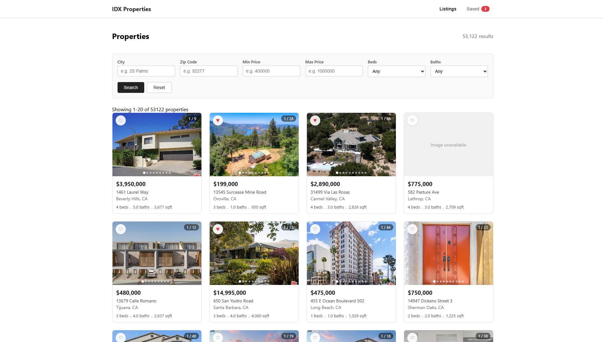

# IDX Property Search

A full-stack real estate property search application that lets users browse, filter, and save MLS property listings. Built with a Node.js/Express REST API backed by MySQL 8, and a React frontend with live filtering, pagination, an image gallery, an interactive map, and a persistent favorites system.

---

## Screenshot



---

## Tech Stack

| Layer | Technology | Version |
|---|---|---|
| Frontend | React | 18.x |
| Frontend routing | React Router DOM | 6.x |
| Frontend type checking | PropTypes | 15.x |
| Backend | Node.js | 18.x |
| Backend framework | Express | 4.x |
| Database | MySQL | 8.x |
| Database client | mysql2 | 3.x |
| Environment variables | dotenv | 16.x |
| Dev server reload | nodemon | 3.x |
| Backend testing | Jest + Supertest | 29.x / 6.x |
| Frontend testing | Jest + React Testing Library | 29.x / 14.x |
| Maps | Google Maps Embed API | v1 |
| Containerization | Docker | 24.x |

---

## Local Setup

### Prerequisites

Before starting, make sure the following are installed on your machine:

- [Node.js 18+](https://nodejs.org/)
- [Docker Desktop](https://www.docker.com/products/docker-desktop/)
- [Git](https://git-scm.com/)

---

### 1. Clone the repository

```bash
git clone https://github.com/yourusername/idx-project.git
cd idx-project
```

---

### 2. Start the MySQL Docker container

```bash
docker run -p 3306:3306 \
  --name idx-mysql-local \
  -e MYSQL_ROOT_PASSWORD=your_password \
  -e MYSQL_DATABASE=rets \
  -d mysql:8
```

Verify it is running:
```bash
docker ps
```

---

### 3. Import the database

```bash
# Import property listings
docker exec -i idx-mysql-local mysql -u root -pyour_password rets < /path/to/rets_property.sql

# Import open house data
docker exec -i idx-mysql-local mysql -u root -pyour_password rets < /path/to/rets_openhouse.sql
```

Verify the import:
```bash
docker exec -it idx-mysql-local mysql -u root -pyour_password rets -e "SELECT COUNT(*) FROM rets_property;"
docker exec -it idx-mysql-local mysql -u root -pyour_password rets -e "SELECT COUNT(*) FROM rets_openhouse;"
```

---

### 4. Create database indexes

Connect to MySQL and run:
```bash
docker exec -it idx-mysql-local mysql -u root -pyour_password rets
```

Then inside the MySQL prompt:
```sql
SET SESSION sql_mode = '';
CREATE INDEX idx_city ON rets_property (L_City);
CREATE INDEX idx_zipcode ON rets_property (L_Zip);
CREATE INDEX idx_price ON rets_property (L_SystemPrice);
CREATE INDEX idx_beds ON rets_property (L_Keyword2);
CREATE INDEX idx_baths ON rets_property (LM_Dec_3);
CREATE INDEX idx_city_price ON rets_property (L_City, L_SystemPrice);
CREATE INDEX idx_city_status_price ON rets_property (L_City, L_Status, L_SystemPrice);
CREATE INDEX idx_full_filter ON rets_property (L_City, L_Status, L_Type_, L_SystemPrice, L_Keyword2, LM_Dec_3);
```

---

### 5. Set up the backend

```bash
cd backend
npm install
```

Create a `.env` file:
```bash
touch .env
```

Add the following to `backend/.env`:
```env
DB_HOST=127.0.0.1
DB_USER=root
DB_PASSWORD=your_password
DB_NAME=rets
DB_PORT=3306
PORT=5000
```

Start the backend dev server:
```bash
npm run dev
```

Verify it is running:
```bash
curl http://localhost:5000/api/health
```

Expected response:
```json
{
  "status": "ok",
  "database": "connected"
}
```

---

### 6. Set up the frontend

```bash
cd frontend
npm install
```

Create a `.env` file:
```bash
touch .env
```

Add the following to `frontend/.env`:
```env
REACT_APP_GOOGLE_MAPS_API_KEY=your_google_maps_api_key
```

Start the frontend dev server:
```bash
npm start
```

The app will open at [http://localhost:3000](http://localhost:3000).

---

### 7. Run tests

Backend:
```bash
cd backend
npm test
```

Frontend:
```bash
cd frontend
npm test
```

---

## Project Structure

```
IDX Project/
├── backend/
│   ├── routes/
│   │   └── properties.js     # All property route handlers
│   ├── db.js                 # MySQL connection pool
│   ├── server.js             # Express app entry point
│   ├── tests/
│   │   └── properties.test.js
│   └── package.json
└── frontend/
    ├── public/
    └── src/
        ├── api/
        │   └── properties.js         # API client functions
        ├── components/
        │   ├── ErrorBoundary.jsx
        │   ├── FavoriteButton.jsx
        │   ├── Navbar.jsx
        │   ├── Pagination.jsx
        │   ├── PropertyCard.jsx
        │   ├── PropertyFilters.jsx
        │   ├── PropertyImageCarousel.jsx
        │   ├── PropertyImageGallery.jsx
        │   └── PropertyMap.jsx
        ├── context/
        │   └── FavoritesContext.js
        ├── hooks/
        │   └── useFavorites.js
        ├── pages/
        │   ├── FavoritesPage.jsx
        │   ├── ListingsPage.jsx
        │   └── PropertyDetailPage.jsx
        └── App.js
```

---

## API Reference

All endpoints are prefixed with `/api`. The backend runs on `http://localhost:5000`.

---

### Health Check

#### `GET /api/health`

Checks whether the server and database are reachable.

**Example request:**
```bash
curl http://localhost:5000/api/health
```

**Success response `200`:**
```json
{
  "status": "ok",
  "database": "connected"
}
```

**Error response `500`:**
```json
{
  "status": "error",
  "database": "failed to connect"
}
```

---

### Properties

#### `GET /api/properties`

Returns a paginated, filterable list of properties.

**Query parameters:**

| Parameter | Type | Description | Example |
|---|---|---|---|
| `city` | string | Filter by city (letters and spaces only) | `Jacksonville` |
| `zipCode` | string | Filter by zip code (exactly 5 digits) | `32099` |
| `minPrice` | number | Minimum listing price | `100000` |
| `maxPrice` | number | Maximum listing price | `500000` |
| `beds` | integer | Minimum number of bedrooms | `3` |
| `baths` | integer | Minimum number of bathrooms | `2` |
| `limit` | integer | Results per page (1–199, default 20) | `20` |
| `offset` | integer | Number of results to skip (default 0) | `40` |

**Example request:**
```bash
curl "http://localhost:5000/api/properties?city=Jacksonville&minPrice=200000&maxPrice=500000&beds=3&limit=20&offset=0"
```

**Success response `200`:**
```json
{
  "count": 142,
  "limit": 20,
  "offset": 0,
  "results": [
    {
      "L_ListingID": "12345",
      "L_Address": "123 Main St",
      "L_City": "Jacksonville",
      "L_State": "FL",
      "L_Zip": "32099",
      "L_SystemPrice": 350000,
      "L_Keyword2": 3,
      "LM_Dec_3": 2.0,
      "LM_Int2_3": 1800,
      "L_Status": "Active"
    }
  ]
}
```

**Validation error response `400`:**
```json
{
  "error": "minPrice must be a number."
}
```

---

#### `GET /api/properties/:id`

Returns a single property by its listing ID.

**Path parameters:**

| Parameter | Type | Description |
|---|---|---|
| `id` | integer | The property's `L_ListingID` |

**Example request:**
```bash
curl http://localhost:5000/api/properties/12345
```

**Success response `200`:**
```json
{
  "L_ListingID": "12345",
  "L_Address": "123 Main St",
  "L_City": "Jacksonville",
  "L_State": "FL",
  "L_Zip": "32099",
  "L_SystemPrice": 350000,
  "L_Keyword2": 3,
  "LM_Dec_3": 2.0,
  "LM_Int2_3": 1800,
  "YearBuilt": 2005,
  "L_Remarks": "Beautiful home in a quiet neighborhood...",
  "L_Status": "Active",
  "L_Type_": "Residential",
  "SubdivisionName": "Riverside",
  "LMD_MP_Latitude": 30.3322,
  "LMD_MP_Longitude": -81.6557
}
```

**Not found response `404`:**
```json
{
  "error": "Property not found."
}
```

**Invalid ID response `400`:**
```json
{
  "error": "ID must be a positive integer."
}
```

---

#### `GET /api/properties/:id/openhouses`

Returns all open house events for a property, ordered by date and start time.

**Path parameters:**

| Parameter | Type | Description |
|---|---|---|
| `id` | integer | The property's `L_ListingID` |

**Example request:**
```bash
curl http://localhost:5000/api/properties/12345/openhouses
```

**Success response `200`:**
```json
{
  "total": 2,
  "results": [
    {
      "id": 1,
      "L_ListingID": "12345",
      "OpenHouseDate": "2024-06-01",
      "OH_StartTime": "10:00:00",
      "OH_EndTime": "12:00:00"
    },
    {
      "id": 2,
      "L_ListingID": "12345",
      "OpenHouseDate": "2024-06-08",
      "OH_StartTime": "13:00:00",
      "OH_EndTime": "15:00:00"
    }
  ]
}
```

**Empty response `200`:**
```json
{
  "total": 0,
  "results": []
}
```

**Not found response `404`:**
```json
{
  "error": "Property not found."
}
```

---

## Database Schema

### `rets_property`

Stores all MLS property listings.

| Column | Type | Description |
|---|---|---|
| `id` | int (PK) | Auto-increment primary key |
| `L_ListingID` | varchar(255) | MLS listing ID (used in API routes) |
| `L_DisplayId` | varchar(255) | Human-readable display ID |
| `L_Address` | varchar(100) | Street address |
| `L_City` | varchar(50) | City |
| `L_State` | varchar(50) | State |
| `L_Zip` | varchar(20) | Zip code |
| `L_SystemPrice` | int | Listing price |
| `L_Keyword2` | int | Number of bedrooms |
| `LM_Dec_3` | decimal(4,1) | Number of bathrooms |
| `LM_Int2_3` | int | Square footage |
| `YearBuilt` | int | Year the property was built |
| `L_Status` | varchar(50) | Listing status (e.g. Active) |
| `L_Type_` | varchar(50) | Property type (e.g. Residential) |
| `L_Remarks` | mediumtext | Property description |
| `L_Photos` | longtext | JSON array of photo URLs |
| `LMD_MP_Latitude` | decimal(18,15) | Latitude coordinate |
| `LMD_MP_Longitude` | decimal(19,15) | Longitude coordinate |
| `SubdivisionName` | varchar(100) | Subdivision or neighborhood name |
| `ListAgentFullName` | varchar(128) | Listing agent full name |
| `ListAgentDirectPhone` | varchar(32) | Listing agent phone number |
| `ListAgentEmail` | varchar(191) | Listing agent email address |
| `LO1_OrganizationName` | varchar(100) | Listing brokerage name |
| `AssociationFee` | int | HOA fee amount |
| `AssociationFeeFrequency` | varchar(50) | HOA fee frequency |
| `DaysOnMarket` | int | Number of days on market |

---

### `rets_openhouse`

Stores open house events linked to property listings.

| Column | Type | Description |
|---|---|---|
| `id` | int (PK) | Auto-increment primary key |
| `L_ListingID` | varchar(255) (FK) | References `rets_property.L_ListingID` |
| `L_DisplayId` | varchar(255) | Human-readable display ID |
| `OpenHouseDate` | date | Date of the open house |
| `OH_StartTime` | time | Start time |
| `OH_EndTime` | time | End time |
| `OH_StartDate` | date | Start date (may differ from OpenHouseDate) |
| `OH_EndDate` | date | End date |

---

### Relationships

```
rets_property (L_ListingID)
       │
       │ one-to-many
       ▼
rets_openhouse (L_ListingID)
```

One property can have many open house events. The relationship is maintained through `L_ListingID` — there is no enforced foreign key constraint in the schema, so the API checks property existence before querying open houses.

---

## Future Improvements

- **Authentication** — Add user accounts so favorites persist server-side across devices rather than in localStorage
- **Search by radius** — Use `LMD_MP_Latitude` and `LMD_MP_Longitude` with a Haversine formula query to find properties within a given distance of a location
- **Sort options** — Let users sort by price (low/high), newest listing, days on market, and square footage
- **Saved searches** — Let users save a filter combination and be notified when new matching listings appear
- **Full-text search** — Add a keyword search against `L_Remarks` using MySQL `FULLTEXT` indexes for natural language property searches
- **TypeScript migration** — Replace PropTypes with TypeScript for compile-time type safety across the full stack
- **CI/CD pipeline** — Add a GitHub Actions workflow that runs all backend and frontend tests on every pull request to `develop`
- **Production deployment** — Containerize the full stack with Docker Compose and deploy to a cloud provider with environment-specific configs
- **Infinite scroll** — Replace pagination with infinite scroll on the listings page for a smoother browsing experience on mobile
- **Image optimization** — Proxy property photos through a CDN and serve WebP format with lazy loading to reduce page load time